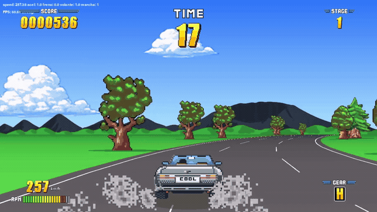
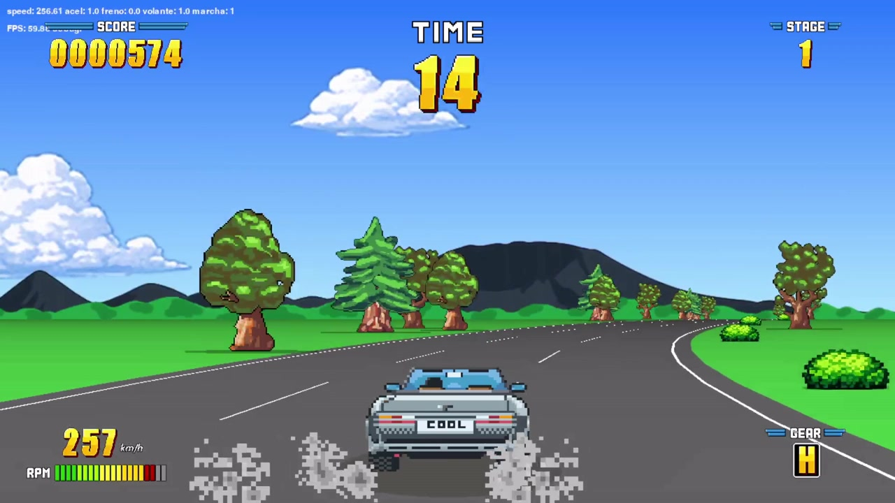
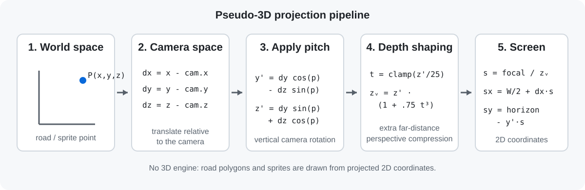

# Pseudo-3D Arcade Racer



A from-scratch pseudo-3D arcade racing game built with **Python and Pygame**, inspired by classic arcade racers from the late '80s and early '90s.

> **Work in progress:** the game is fully playable, but scenery, visual assets, progression and balancing are still being developed.

## About the project

This is primarily a **learning and experimentation project**.

Rather than starting from an existing pseudo-3D engine or implementation, I'm building the renderer and game systems from scratch to understand how this kind of game works under the hood. What started as an experiment in rendering a pseudo-3D road has gradually turned into an actual playable arcade racer.

The goal isn't realistic driving simulation. I'm interested in the feel of classic arcade racing: speed, readable controls, risk, traffic, and making constant decisions about how hard to push the car.

## Gameplay



The driving model is designed to be easy to understand but leave room for experimentation.

Cornering depends not only on speed and road curvature, but also on where the car is positioned on the road. There isn't always a single ideal line: taking a corner aggressively may save time but leave the car badly positioned for the next one, while slowing down can sometimes make a sequence of corners faster overall.

The aim is to balance speed, position and risk, especially through sequences of opposing curves.

**Driving should be easy. Driving well shouldn't be.**

## Current features

- Custom pseudo-3D road renderer
- Arcade driving physics and smooth keyboard controls
- Position-dependent cornering behaviour
- Different road surfaces with different grip and handling characteristics
- Traffic and collision system
- Continuous collision detection at high speed
- Roadside objects and scenery
- Shadows and visual effects
- Particle effects
- HUD and race timer
- Data-driven track generation
- 60 FPS gameplay

## Running the game

The game requires **Python 3** and three external dependencies:

```bash
pip install pygame numpy sounddevice
```

Clone the repository:

```bash
git clone https://github.com/mefistofeles57/pseudo3d.git
cd pseudo3d
```

Run it with:

```bash
python Juego.py
```

## Controls

| Key | Action |
| --- | --- |
| Up arrow | Accelerate |
| Down arrow | Brake |
| Left / Right arrows | Steer |
| Space | Change gear |

## How the pseudo-3D projection works

There is no conventional 3D engine behind the road. World-space points are transformed relative to the camera, rotated by the camera pitch, and then projected onto the 2D screen.



For a world point `P(x, y, z)`, the first step is translation into camera-relative coordinates:

```text
dx = x - camera_x
dy = y - camera_y
dz = z - camera_z
```

The vertical plane is then rotated by the camera pitch:

```text
y2 = dy * cos(pitch) - dz * sin(pitch)
z2 = dy * sin(pitch) + dz * cos(pitch)
```

The renderer also applies an additional non-linear depth transformation. This compresses the far distance and reduces excessive perspective deformation:

```text
t = clamp(z2 / MAX_Z, 0, 1)
z_visual = z2 * (1 + STRENGTH * t^POWER)
```

The current values are `MAX_Z = 25`, `STRENGTH = 0.75` and `POWER = 3`.

Finally, the transformed point is projected onto the screen:

```text
scale = focal / z_visual

screen_x = screen_width / 2 + dx * scale
screen_y = horizon - y2 * scale
```

Road edges, cars, roadside objects and other elements use this projection to share the same apparent depth. The final scene is built from **2D polygons and sprites**, even though the result creates the illusion of a 3D road.

## Development status

The core renderer, driving model and collision systems are working and the game is playable from start to finish.

Current work is focused mainly on:

- scenery and visual assets
- track content
- gameplay balancing
- UI and progression
- general polish

Expect things to change frequently.

## Why Pygame?

Because building this from scratch is the point.

The project isn't intended to demonstrate the easiest way to make a racing game. Using an existing 3D engine would obviously make many parts of the process simpler.

I'm interested in understanding the techniques behind pseudo-3D arcade racers, experimenting with them, breaking things, fixing them, and seeing how far I can take the idea using Python and Pygame.

## Gameplay video

[Watch the current gameplay video on YouTube](https://youtu.be/mZjY_mZjY_iRJYPY)

## Source code

The project is open source because experimentation and learning are the main reasons it exists.

Feel free to explore the code, try the game, or follow its development.
